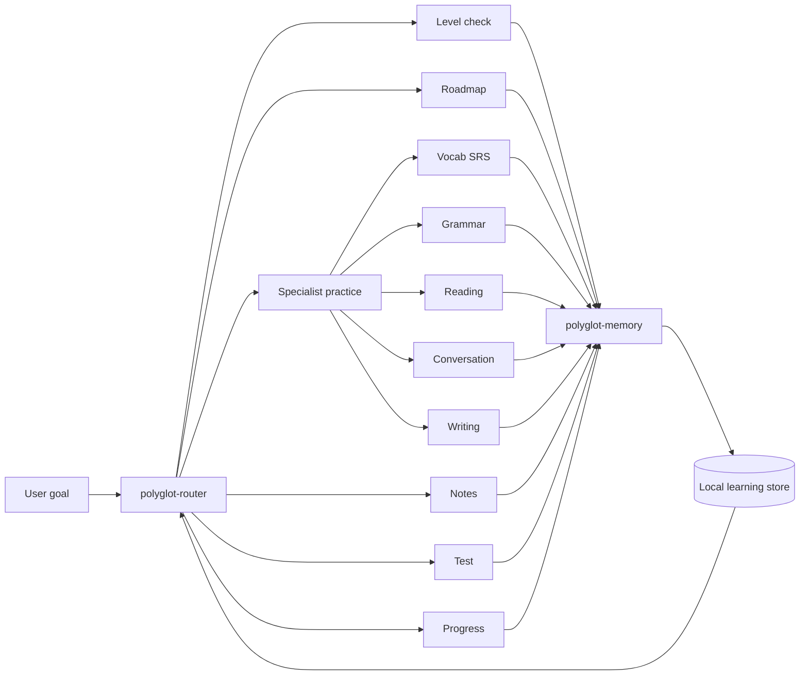

# Polyglot Learning OS

> A router-led Codex skill set for goal-driven language learning across multiple languages.

[](.codex-plugin/plugin.json)
[](LICENSE)
[](tests)
[](README.zh-CN.md)


Polyglot Learning OS turns language study into an evidence-driven loop: assess the learner, plan against a deadline, practice with focused specialists, store durable memory, and adapt the next session from real progress.

It is built as a Codex plugin with one central router and a set of specialist skills for level checks, roadmaps, grammar, vocabulary, reading, conversation, writing, notes, tests, progress analysis, and local learning memory.

## Why It Exists

Most AI language practice is session-based: useful in the moment, easy to lose afterward. Polyglot Learning OS is designed around continuity.

- Start from a target level, deadline, daily time budget, and current evidence.
- Route each study turn to the smallest specialist that can move the learner forward.
- Persist structured learning state: sessions, SRS items, weak patterns, notes, assessments, and next focus.
- Use CEFR by default while leaving room for local goals such as JLPT, HSK, TOPIK, DELE, DELF/DALF, Goethe, IELTS, TOEFL, and workplace targets.

## Demo Flow


The default loop is:

```text
assess -> plan -> review -> teach -> practice -> feedback -> notes -> test -> adapt
```

## Skill Map

Use `$polyglot-router` as the normal entry point. The router keeps the learner's goal, deadline, due reviews, weak patterns, and recent evidence in view, then routes to the right specialist.

| Skill | Role |
|---|---|
| `$polyglot-router` | Chooses the next best action and coordinates the study loop. |
| `$polyglot-level-check` | Estimates the current level from evidence. |
| `$polyglot-roadmap` | Builds a deadline-aware plan for a target level. |
| `$polyglot-vocab` | Reviews due items and grows vocabulary with SRS. |
| `$polyglot-grammar` | Teaches and drills recurring form, syntax, and register issues. |
| `$polyglot-reading` | Turns texts and sources into comprehensible input practice. |
| `$polyglot-conversation` | Runs role-play, fluency practice, and repair strategies. |
| `$polyglot-writing` | Corrects writing and extracts reusable improvement patterns. |
| `$polyglot-notes` | Writes durable study notes and mistake pages. |
| `$polyglot-test` | Runs weekly checks, placement probes, and mock exams. |
| `$polyglot-progress` | Summarizes progress and repairs the plan. |
| `$polyglot-memory` | Persists validated profile, session, SRS, test, and note updates. |

## Quick Start

Clone the repository:

```bash
git clone https://github.com/Sean-hsj/polyglot.git
cd polyglot
```

This repository is laid out as a Codex plugin. The plugin manifest is at [`.codex-plugin/plugin.json`](.codex-plugin/plugin.json), and all skills live under [`skills/`](skills).

After enabling the plugin in Codex, start with:

```text
Use $polyglot-router to help me reach B1 Japanese by December with 30 minutes per day.
```

Useful prompts:

```text
Use $polyglot-router to decide what I should study today.
Use $polyglot-level-check to estimate my current Spanish level.
Use $polyglot-roadmap to build a plan for French A2 -> B1 by October.
Use $polyglot-writing to correct this German email and turn my mistakes into drills.
Use $polyglot-progress to tell me whether my current plan is still realistic.
```

## Sample Workflow

You can also exercise the deterministic helpers directly from the command line.

Create a local learning store:

```bash
export POLYGLOT_LEARNING_DIR=.polyglot-demo

python3 skills/polyglot-router/scripts/learning_store.py init \
  --name "Learner" \
  --native-language English \
  --target-language Spanish \
  --current-level A1 \
  --target-level A2 \
  --deadline 2027-07-04 \
  --daily-minutes 30 \
  --goal conversation
```

Calculate a roadmap:

```bash
python3 skills/polyglot-roadmap/scripts/roadmap_calculator.py calculate <<'JSON'
{
  "language": "Spanish",
  "current_level": "A1",
  "target_level": "A2",
  "start_date": "2026-07-04",
  "deadline": "2027-07-04",
  "daily_minutes": 30,
  "goal": "conversation"
}
JSON
```

Record a study session:

```bash
python3 skills/polyglot-router/scripts/learning_store.py record <<'JSON'
{
  "session": {
    "language": "Spanish",
    "date": "2026-07-04",
    "duration_minutes": 30,
    "skills": ["vocabulary", "grammar", "conversation"],
    "summary": "Practiced introductions and adjective agreement.",
    "accuracy": 0.76
  },
  "new_items": [
    {
      "id": "es-phrase-encantado",
      "type": "phrase",
      "front": "encantado de conocerte",
      "back": "pleased to meet you",
      "level": "A1"
    }
  ],
  "review_results": [{"id": "es-phrase-encantado", "quality": 4}],
  "errors": [
    {
      "pattern_id": "es-adjective-gender",
      "category": "grammar",
      "severity": "major",
      "learner_answer": "una casa bonito",
      "correct_answer": "una casa bonita",
      "context": "noun-adjective agreement"
    }
  ],
  "next_focus": [
    "Review adjective gender agreement.",
    "Run one short introduction role-play."
  ]
}
JSON
```

Check progress:

```bash
python3 skills/polyglot-router/scripts/learning_store.py progress
```

## Local Learning Store

The router stores learning data through [`skills/polyglot-router/scripts/learning_store.py`](skills/polyglot-router/scripts/learning_store.py). Store location is resolved in this order:

1. `POLYGLOT_LEARNING_DIR`
2. `./data` when it already contains `profile.json`
3. `~/.codex/polyglot-learning-os`

The store contains:

| File | Purpose |
|---|---|
| `profile.json` | Learner, languages, goals, levels, weak patterns, next focus. |
| `sessions.json` | Study sessions with skills, accuracy, summaries, and errors. |
| `srs.json` | Spaced repetition items and SM-2 review state. |
| `assessments.json` | Level checks, checkpoints, and test results. |
| `notes-index.json` | Durable notes produced by `polyglot-notes`. |

All mutations go through `learning_store.py record`, which validates the payload and creates a pre-record backup before writing.

## Architecture



More detail lives in:

- [`system-architecture.md`](skills/polyglot-router/references/system-architecture.md)
- [`operational-workflow.md`](skills/polyglot-router/references/operational-workflow.md)
- [`data-contract.md`](skills/polyglot-router/references/data-contract.md)
- [`exercise-protocols.md`](skills/polyglot-router/references/exercise-protocols.md)
- [`feedback-protocol.md`](skills/polyglot-router/references/feedback-protocol.md)
- [`rubrics.md`](skills/polyglot-router/references/rubrics.md)

## Repository Layout

```text
.
├── .codex-plugin/plugin.json
├── skills/
│   ├── polyglot-router/
│   ├── polyglot-roadmap/
│   ├── polyglot-vocab/
│   ├── polyglot-grammar/
│   ├── polyglot-reading/
│   ├── polyglot-conversation/
│   ├── polyglot-writing/
│   ├── polyglot-notes/
│   ├── polyglot-test/
│   ├── polyglot-level-check/
│   ├── polyglot-progress/
│   └── polyglot-memory/
├── tests/
└── docs/assets/
```

## Validation

Run the test suite:

```bash
python3 -m unittest discover -s tests -v
```

The current suite covers:

- Store initialization, validation, reads, due reviews, progress summaries, and safe mutation.
- SRS update behavior and weak-pattern aggregation.
- Roadmap calculation and feasibility checks.
- Note writing and `note_updates[]` compatibility.
- End-to-end workflow coverage from goal to roadmap to note to memory.
- Shared protocol references across the specialist skills.

## Project Status

Polyglot Learning OS is early but usable. The current focus is not adding more specialists; it is making the learning loop more reliable through realistic forward tests, stronger language-specific examples, and clearer installation ergonomics.

## Contributing

Contributions are welcome when they improve the learning loop rather than adding disconnected prompts. Good contributions usually do one of these:

- Tighten a skill's routing behavior.
- Add a realistic language-specific workflow.
- Improve validation around durable learning state.
- Add tests for a complete learner journey.
- Make notes, assessments, or SRS updates easier to inspect.

Please run the test suite before opening a PR.

## License

MIT. See [LICENSE](LICENSE).
