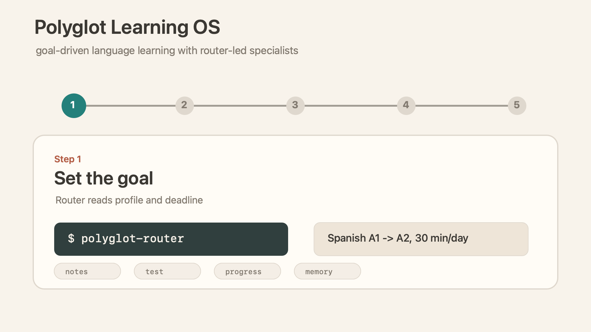
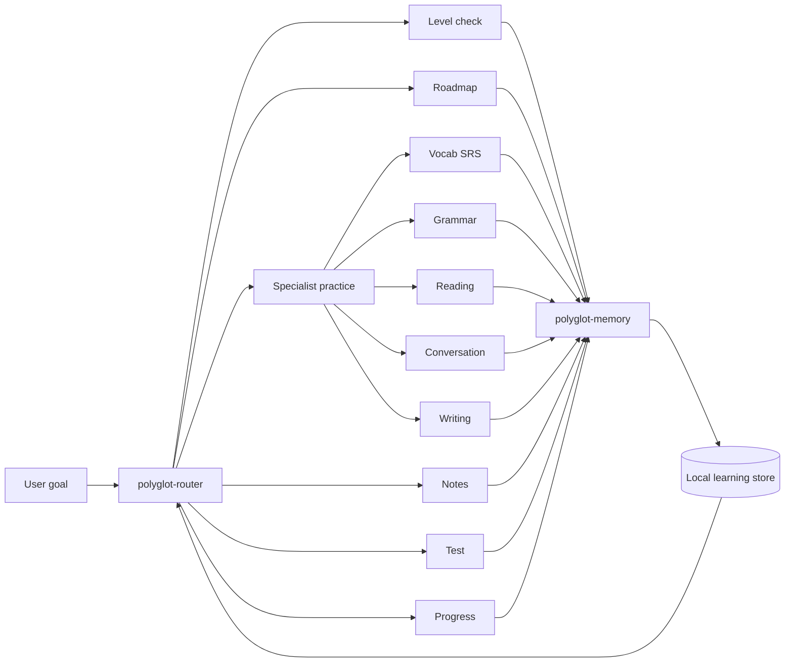

# Polyglot Learning OS

> 一个由中心 router 驱动的 Codex 技能集，用来管理多语言、目标导向的语言学习。

[](.codex-plugin/plugin.json)
[](LICENSE)
[](tests)
[](README.md)


Polyglot Learning OS 把语言学习组织成一条可持续的证据闭环：先评估当前水平，再根据目标和 deadline 做计划，然后由不同 specialist 进行练习、反馈、记笔记、保存学习记忆，并用真实进度调整下一次学习。

它是一个 Codex plugin。核心是 `$polyglot-router`，它会协调 level check、roadmap、grammar、vocabulary、reading、conversation、writing、notes、test、progress 和本地 learning memory。

## 为什么做这个项目

很多 AI 语言练习只在当下有效，结束后上下文和学习痕迹就散掉了。Polyglot Learning OS 关注的是连续性。

- 从目标等级、deadline、每天可用时间和当前证据开始。
- 每一轮学习都由 router 分配给最合适、最小粒度的 specialist。
- 持久化结构化学习状态：session、SRS、薄弱模式、笔记、测评和下一步重点。
- 默认使用 CEFR，也可以兼容 JLPT、HSK、TOPIK、DELE、DELF/DALF、Goethe、IELTS、TOEFL 或工作场景目标。

## Demo Flow



默认学习闭环是：

```text
assess -> plan -> review -> teach -> practice -> feedback -> notes -> test -> adapt
```

## 技能地图

正常入口是 `$polyglot-router`。它会读取学习目标、deadline、待复习内容、薄弱模式和最近学习证据，然后路由到合适的 specialist。

| Skill | 作用 |
|---|---|
| `$polyglot-router` | 选择下一步学习动作并协调整个学习闭环。 |
| `$polyglot-level-check` | 基于证据估计当前语言水平。 |
| `$polyglot-roadmap` | 根据目标等级和 deadline 制定计划。 |
| `$polyglot-vocab` | 处理待复习词条，并用 SRS 扩展词汇。 |
| `$polyglot-grammar` | 教授和训练反复出现的语法、结构、语域问题。 |
| `$polyglot-reading` | 把文本和材料转成可理解输入练习。 |
| `$polyglot-conversation` | 进行角色扮演、口语流利度和修复策略练习。 |
| `$polyglot-writing` | 批改写作，并抽取可复用的改进模式。 |
| `$polyglot-notes` | 生成持久化学习笔记和错误页。 |
| `$polyglot-test` | 运行周测、水平探测和模拟考试。 |
| `$polyglot-progress` | 总结进度并修复学习计划。 |
| `$polyglot-memory` | 持久化 profile、session、SRS、test 和 note 更新。 |

## Quick Start

克隆仓库：

```bash
git clone https://github.com/Sean-hsj/polyglot.git
cd polyglot
```

这个仓库已经按 Codex plugin 结构组织。plugin manifest 在 [`.codex-plugin/plugin.json`](.codex-plugin/plugin.json)，所有技能都在 [`skills/`](skills) 下。

在 Codex 中启用 plugin 后，从 router 开始：

```text
Use $polyglot-router to help me reach B1 Japanese by December with 30 minutes per day.
```

常用 prompt：

```text
Use $polyglot-router to decide what I should study today.
Use $polyglot-level-check to estimate my current Spanish level.
Use $polyglot-roadmap to build a plan for French A2 -> B1 by October.
Use $polyglot-writing to correct this German email and turn my mistakes into drills.
Use $polyglot-progress to tell me whether my current plan is still realistic.
```

## 示例 Workflow

你也可以直接用命令行运行确定性 helper。

创建本地学习仓库：

```bash
export POLYGLOT_LEARNING_DIR=.polyglot-demo

python3 skills/polyglot-router/scripts/learning_store.py init \
  --name "Learner" \
  --native-language English \
  --target-language Spanish \
  --current-level A1 \
  --target-level A2 \
  --deadline 2027-07-04 \
  --daily-minutes 30 \
  --goal conversation
```

生成 roadmap：

```bash
python3 skills/polyglot-roadmap/scripts/roadmap_calculator.py calculate <<'JSON'
{
  "language": "Spanish",
  "current_level": "A1",
  "target_level": "A2",
  "start_date": "2026-07-04",
  "deadline": "2027-07-04",
  "daily_minutes": 30,
  "goal": "conversation"
}
JSON
```

记录一次学习 session：

```bash
python3 skills/polyglot-router/scripts/learning_store.py record <<'JSON'
{
  "session": {
    "language": "Spanish",
    "date": "2026-07-04",
    "duration_minutes": 30,
    "skills": ["vocabulary", "grammar", "conversation"],
    "summary": "Practiced introductions and adjective agreement.",
    "accuracy": 0.76
  },
  "new_items": [
    {
      "id": "es-phrase-encantado",
      "type": "phrase",
      "front": "encantado de conocerte",
      "back": "pleased to meet you",
      "level": "A1"
    }
  ],
  "review_results": [{"id": "es-phrase-encantado", "quality": 4}],
  "errors": [
    {
      "pattern_id": "es-adjective-gender",
      "category": "grammar",
      "severity": "major",
      "learner_answer": "una casa bonito",
      "correct_answer": "una casa bonita",
      "context": "noun-adjective agreement"
    }
  ],
  "next_focus": [
    "Review adjective gender agreement.",
    "Run one short introduction role-play."
  ]
}
JSON
```

查看进度：

```bash
python3 skills/polyglot-router/scripts/learning_store.py progress
```

## 本地学习数据

router 通过 [`skills/polyglot-router/scripts/learning_store.py`](skills/polyglot-router/scripts/learning_store.py) 存储学习数据。数据目录按这个顺序解析：

1. `POLYGLOT_LEARNING_DIR`
2. 当前目录下已经存在 `profile.json` 的 `./data`
3. `~/.codex/polyglot-learning-os`

学习仓库包含：

| 文件 | 用途 |
|---|---|
| `profile.json` | 学习者、语言、目标、等级、薄弱模式、下一步重点。 |
| `sessions.json` | 学习 session、练习技能、准确率、摘要和错误。 |
| `srs.json` | 间隔重复条目和 SM-2 复习状态。 |
| `assessments.json` | 水平检查、阶段测试和考试结果。 |
| `notes-index.json` | `polyglot-notes` 生成的持久化笔记索引。 |

所有写入都经过 `learning_store.py record`。它会先校验 payload，并在写入前创建备份。

## 架构



更多细节：

- [`system-architecture.md`](skills/polyglot-router/references/system-architecture.md)
- [`operational-workflow.md`](skills/polyglot-router/references/operational-workflow.md)
- [`data-contract.md`](skills/polyglot-router/references/data-contract.md)
- [`exercise-protocols.md`](skills/polyglot-router/references/exercise-protocols.md)
- [`feedback-protocol.md`](skills/polyglot-router/references/feedback-protocol.md)
- [`rubrics.md`](skills/polyglot-router/references/rubrics.md)

## 仓库结构

```text
.
├── .codex-plugin/plugin.json
├── skills/
│   ├── polyglot-router/
│   ├── polyglot-roadmap/
│   ├── polyglot-vocab/
│   ├── polyglot-grammar/
│   ├── polyglot-reading/
│   ├── polyglot-conversation/
│   ├── polyglot-writing/
│   ├── polyglot-notes/
│   ├── polyglot-test/
│   ├── polyglot-level-check/
│   ├── polyglot-progress/
│   └── polyglot-memory/
├── tests/
└── docs/assets/
```

## 验证

运行测试：

```bash
python3 -m unittest discover -s tests -v
```

当前测试覆盖：

- store 初始化、校验、读取、待复习、进度摘要和安全写入。
- SRS 更新行为和 weak pattern 聚合。
- roadmap 计算和可行性判断。
- note writer 与 `note_updates[]` 的兼容性。
- 从目标到 roadmap、note、memory 的端到端流程。
- specialist skills 对共享协议的引用。

## 项目状态

Polyglot Learning OS 还处于早期，但已经可用。当前重点不是继续堆更多 specialist，而是通过真实 forward test、语言特定例子和更清晰的安装体验，把学习闭环打磨得更可靠。

## Contributing

欢迎贡献，但最好围绕学习闭环本身，而不是增加孤立 prompt。比较好的贡献通常包括：

- 收紧 skill 的 routing 行为。
- 增加真实的语言特定 workflow。
- 改进 durable learning state 的校验。
- 给完整学习旅程增加测试。
- 让 notes、assessments 或 SRS 更新更容易检查。

提交 PR 前请先运行测试。

## License

MIT. See [LICENSE](LICENSE).
